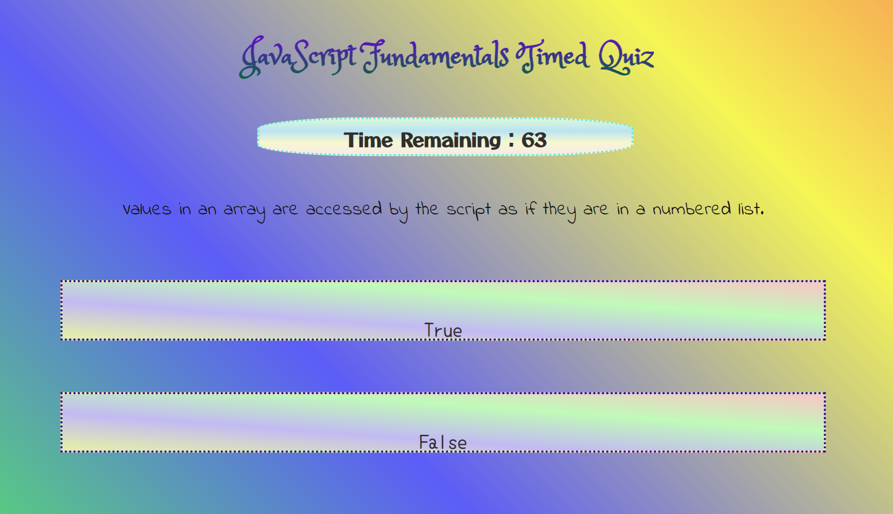
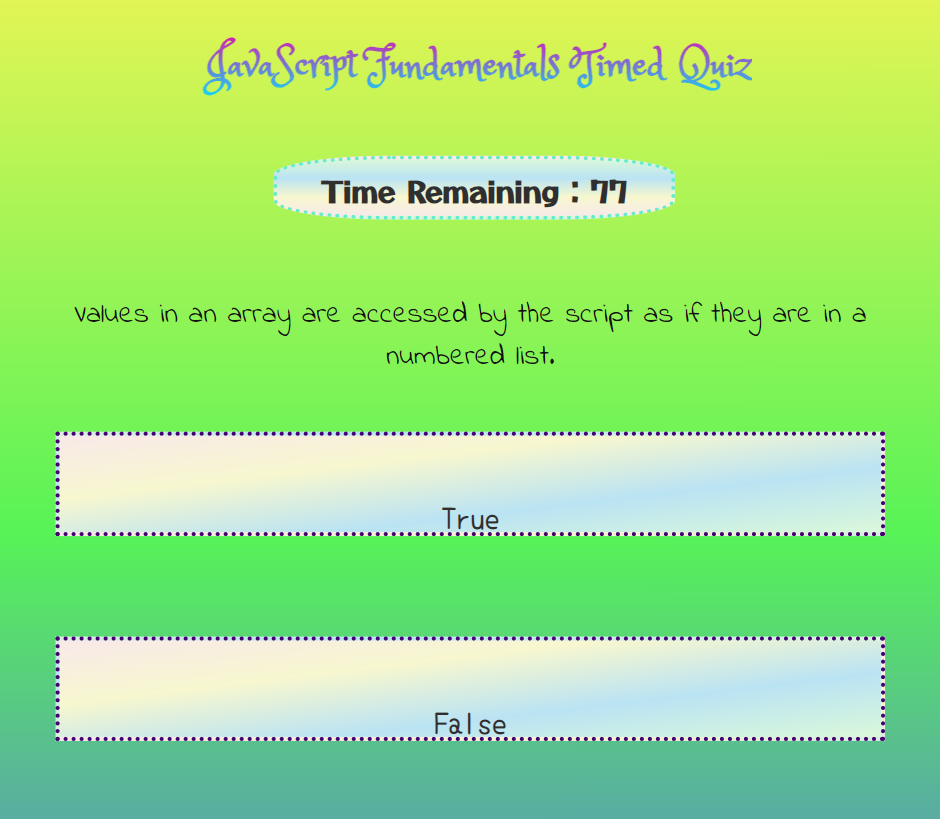
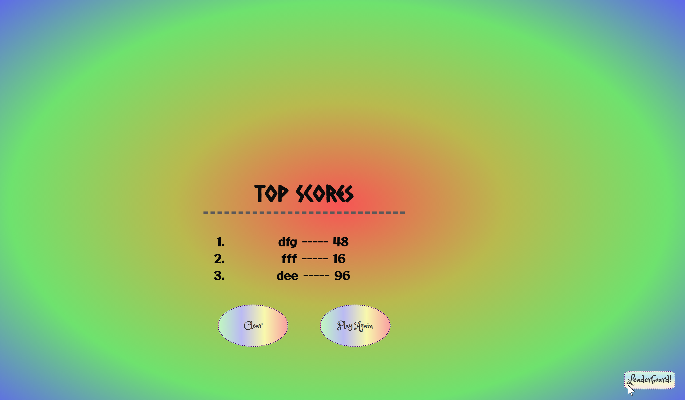

# 04 Web APIs: Code Quiz

This week’s homework is where we build a timed coding quiz with multiple-choice questions. This app will run in the browser and will feature dynamically updated HTML and CSS powered by JavaScript code. It will have a clean, polished, and responsive user interface. 

## User Story

```
AS A coding boot camp student I WANT to take a timed quiz on JavaScript fundamentals that stores high scores SO THAT I can gauge my progress compared to my peers
```

## Acceptance Criteria

```
GIVEN I am taking a code quiz:
✓ WHEN I click the start button THEN a timer starts and I am presented with a question
✓ WHEN I answer a question THEN I am presented with another question
✓ WHEN I answer a question incorrectly THEN time is subtracted from the clock
✓ WHEN all questions are answered or the timer reaches 0 THEN the game is over
✓ WHEN the game is over THEN I can save my initials and my score
```

--------------------------------
# DNB's SOLUTION: 
UNC Boot Camp Submission: 🗂️ [Github Repository](https://github.com/DionneNoellaBarretto/04-CodeQuizApp_HW4) | 📄[Github Page](https://dionnenoellabarretto.github.io/04-CodeQuizApp_HW4/)

--------------------------------


### ResponseUI Solution - Desktop, Tablet & Mobile Views
Starting Screen-Desktop View

QuestionScreen on Desktop/Laptop Screen

QuestionScreen on Tablet Screen

QuestionScreen on Mobile Screen

Correct/Incorrect Answer Notification


Leaderboard Top Scores Desktop View

If you complete all 25 questions before the 100 second timer runs out you will see a prompt like this:


## Grading Criteria Mock-Up

The following animation demonstrates the application functionality :


## Grading Requirements

This homework is graded based on the following criteria: 

### Technical Acceptance Criteria: 40%
```
✅ Satisfies all of the preceding acceptance criteria.
```

### Deployment: 32%

```
✅ Application deployed at live URL.

✅ Application loads with no errors.

✅ Application GitHub URL submitted.

✅ GitHub repository contains application code.
```

### Application Quality: 15%
```
✅ Application user experience is intuitive and easy to navigate.

✅ Application user interface style is clean and polished.

✅ Application resembles the mock-up functionality provided in the homework instructions.
```

### Repository Quality: 13%

```
✅ Repository has a unique name.

✅ Repository follows best practices for file structure and naming conventions.

✅ Repository follows best practices for class/id naming conventions, indentation, quality comments, etc.

✅ Repository contains multiple descriptive commit messages.

✅ Repository contains quality readme file with description, screenshot, and link to deployed application.
```